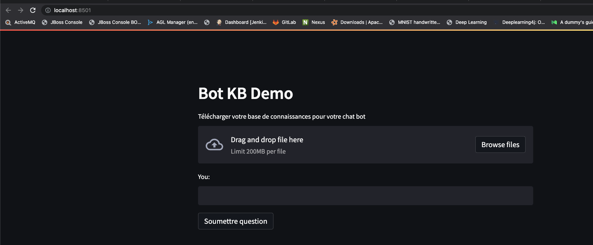

### Chat Bot avec une base de connaissances (KB)

<br>
Chat Bot avec un KB local pour Confoo

L'objectif de ce bot est de permettre de répondre aux questions d'un utilisateur sur une base de connaissances qui est privée.


Utilisation de [LangChain](https://langchain.readthedocs.io/en/latest/index.html) pour fabriquer une base de données de connaissances en locale avec le contenu du fichier farid-RAG.txt.

Utilisation de [OpenAI](https://platform.openai.com/docs/introduction) pour le [LLM](https://www.mlq.ai/what-is-a-large-language-model-llm/) (Large Language Model).

Utilisation de [SreamLit](https://docs.streamlit.io/) pour gérer le server et l'interface Web du Bot.

Pour installer les librairie Python requises:

```sh
./setup.sh
```

Pour exécuter le chat Bot:
```sh
./start.sh
```



Une fois le serveur lancé, déposer par drag and drop le fichier [farid-RAG.txt](demo/farid-RAG.txt).

Cela devrait générer le vector store vectorstore.pkl. Ce vector store contient la version embeddings du fichier déposé.

Pour plus de détail sur les embeddings voir [OpenAI Embeddings](https://platform.openai.com/docs/guides/embeddings/).

Vous pouvez maintenant poser votre question...
